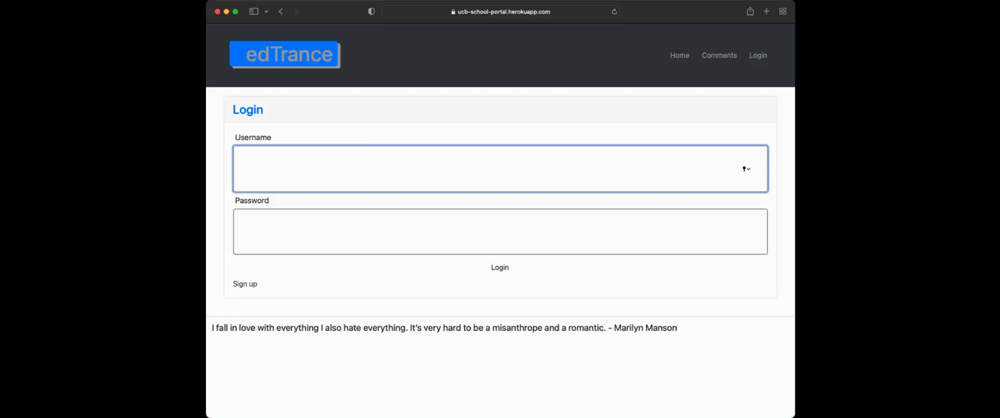
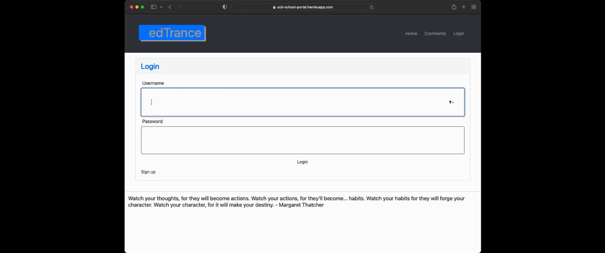
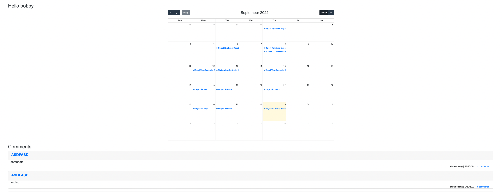
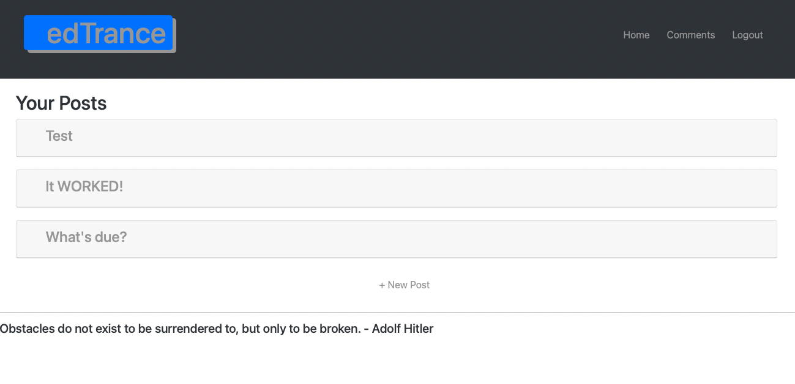
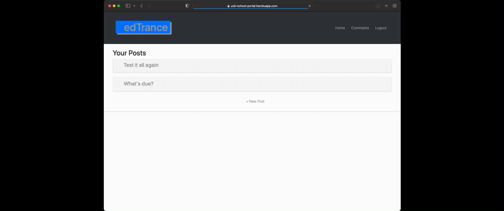

# CLASS LINK
This application is called Class Link. This app is a portal to provide calendar in order for the user to see what is scheduled for the month, week, or day. User will also have the ability to start a conversation in regards to the events by creating a post. Other users will be able to see all the posts and respond in each of the post in the comments section. 

This is a collaborative work to provide an interactive experience. This application is created to exhibit our knowledge in Node.js, Express.js, Handlebars.js, MySQL, and Sequalize.

> PROJECT REQUIREMENTS:

* Use Node.js and Express.js to create a RESTful API.
* Use Handlebars.js as a template engine.
* Use MySQL and Sequalize ORM for the database.
* Have both GET and POST routes for retrieving and adding new data.
* Use at lease one new library, package, or technology that we haven't discussed.
* Have a folder structure that meets the MVC paradigm.
* Include authentication (express-session and cookies).
* Protect API keys and sensistive information with environment variables.
* Be deployed using Heroku (with data).

## User Story
> As a parent/student who needs an update on school schedules and to contact teachers

> I WANT to be able to access a portal with both functions

> SO THAT I will be able check my calendar and communicate with teachers in one app

## Accessing the Application
Too access the application, you can follow the deployment link in Heroku below.

Heroku Link: [Class Link](https://ucb-school-portal.herokuapp.com/login)

# Application Functionality
* User will be able to sign up for an account.

* If user is already signed up, user will be able to log in using the credentials during sign up process.

* Once logged in, user will be presented with the calendar and all the current posts.

* User will be able to read all the comments under each posts.

* User will be able to add a comment in any post.

* All previous posts of user can be viewed under `Comments`.

* User will be able to create a new post.

* User will be able to edit post.

* User will be able to delete post.

* User will be able to log out safely.

## Technologies Used
* Node
* Express
* MySQL
* Sequelize
* API (Google API and random quote generator)
* Handlebars
* SweetAlert2
* Bcrypt
* Bootstrap

# Contributors
* [Scott Wattenbarger](https://github.com/scottwatt)
* [Shawn Chang](https://github.com/shawnchangs)
* [Dennis Mateo](https://github.com/itsDenMat)
* [Cassandra Kise](https://github.com/cassandrakise)
* [Thomas Woldetsadik](https://github.com/FormulaXYZ)

